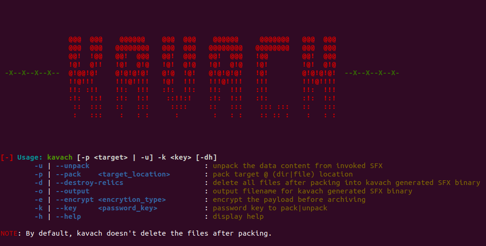
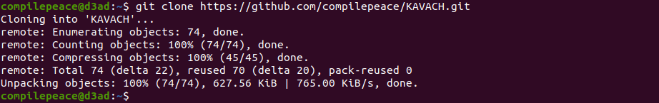
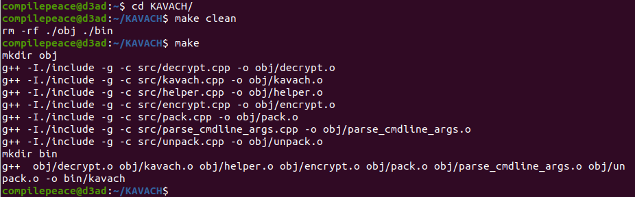
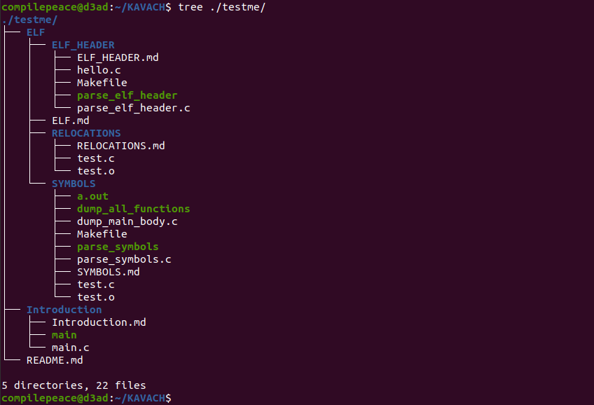
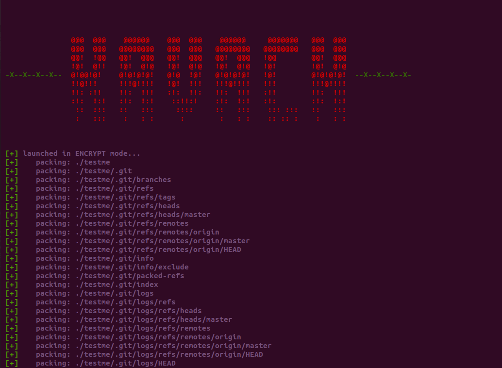
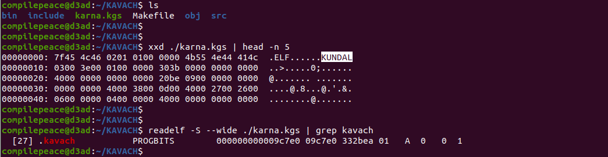
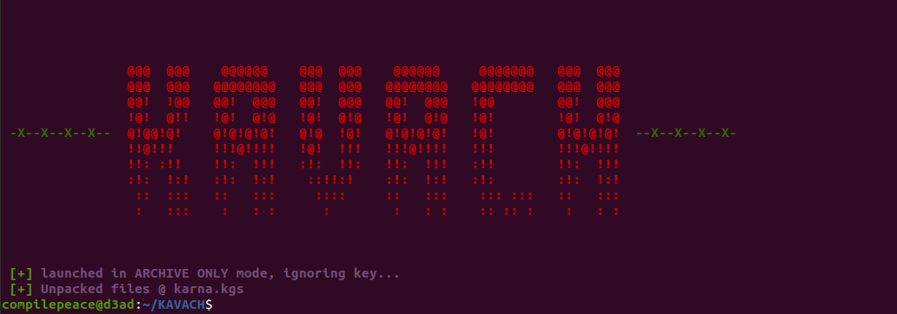
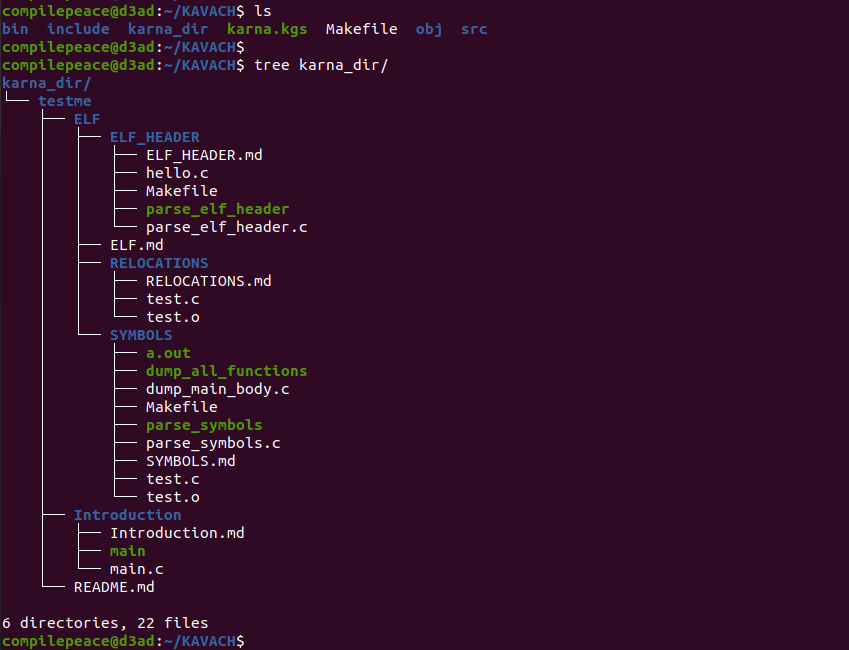

# KAVACH


Kavach is a free and open source **data protection software**, technically a **self-distributing SFX/SEA** software for Linux whose development was inspired by [Karna]'s armour. The idea of this software is to eliminate the need for installation of additional system software rather carrying the code to unpack archive meaning -

"If you have a kavach generated archive, you definitely have its unpacker." 

**SFX** (**SelF eXtractor**) or a **SEA** (**Self Extracting Archive**) allows the user to archive the supplied files with executable code such that *no software installation* is required to unpack the files rather execution of SFX archive is enough to unpack the files. Self-distributing software means a single **K**avach **G**enerated **S**FX (**.kgs**) archive can be used to create other archives due to its *code body* having a ***self-replicating nature***. 

 
 **NOTE**: Kavach uses a custom binary format termed as KBF (short for **K**avach **B**inary **F**ormat) to zip files either in **plain text (raw unchanged bytes)** or an **encrypted (scrambled senseless bytes)** form.


## KUNDAL (*.kgs)
It has a *custom binary format* responsible for posessing payload and metadata which considering modularity is made **independently parsable**, i.e. making kavach code and payload mutually exclusively independent of each other. It tries to **retain** most of the file's metadata while *packing/unpacking* data. Along with the directory structure, it preserves-
* File/Directory **permission bits**.
* Last **access** and last **modification** timestamp.
* KBF is scalable to extend to additional attributes too (like **ownership** information) with slight modification.

The ELF binary packed/archived by kavach code body has an extension of **.kgs** (short for **K**avach **G**enerated **S**FX) along with a **KUNDAL** (indicating a packed binary) in its ELF header (at an offset of 0x8 bytes). 


## CHECK IT OUT !
To use it, you can build kavach from source code by following -



### Build
To build, leverage the `make` utility.



### Pack
By default, kavach runs in *archive only* mode. Using `--encrypt` flag allows us to specify an encryption routine to scramble sensitive data. Let's look at the target directory tree to archive named *testme*.



To pack this directory tree, invoke the program and pass relevant flags as below - 
```
compilepeace@d3ad:~/KAVACH$ ./bin/kavach --pack "./testme" --output karna --encrypt xor --key "Am I an evil" --destroy-relics
```



**NOTE**: Kavach can be scaled upto the target's component-level encryption (i.e. different encryption routine with a same/different key for every file to be archived). Even the filenames can be encrypted with slight modifications as KBF has a seperate **names table** which centerally stores all name strings.

### Packed artifacts



We see a binary named `karna.kgs`, i.e. the generated SFX. A kavach **packed** SFX (\*.kgs) can be identified by the signature - **KUNDAL** that is present inside the padding of ELF header (starting @ offset 0xa). All .kgs binaries have a special section named `.kavach` which accounts for the entire KBF (Kavach Binary Format).


### Unpack
```
compilepeace@d3ad:~/KAVACH$ ./karna.kgs --unpack karna.kgs --key "Am I an evil"
```



By default, the payload is unpacked in a directory named \<packed_filename\>_dir.




*Kavach* indeed refers to the code body either of the **originally compiled kavach software** or any generated **\*.kgs** binary both of which will act as original kavach software.

<br>

[Karna]: https://en.wikipedia.org/wiki/Karna


**NAME**  : Abhinav Thakur <br>
**EMAIL** : compilepeace@gmail.com  
